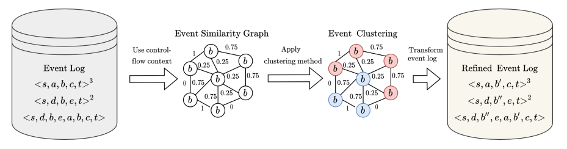
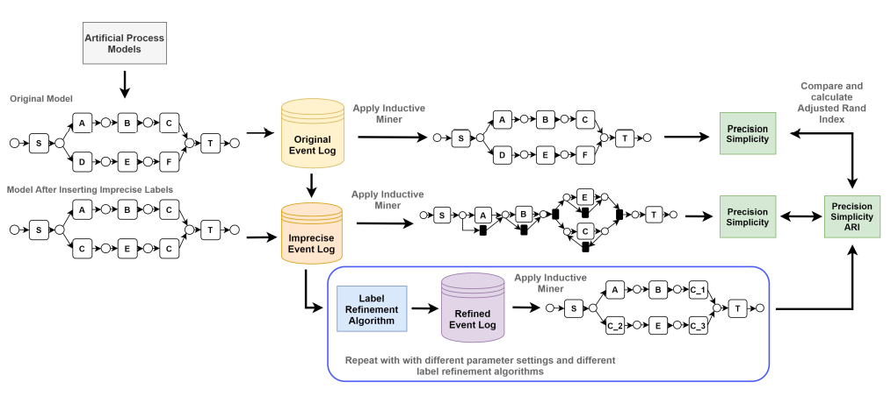

# Event Label Refinement by Applying Community Detection to Event Similarity Graphs

For detailed insights into the context-based activity label-splitting technique, please refer to the research paper: [Context-Based Activity Label-Splitting](https://sebastiaanvanzelst.com/wp-content/uploads/2023/08/paper_5152-1.pdf).

This repository contains the code and experiments results from the
Bachelor's Thesis "Event Label Refinement by Applying
Community Detection to Event Similarity Graphs" and for the paper "Context-based Activity Label-Splitting".

pm-label-splitting contains the implementation of our approach. labelrefinement is the implementation we used to collect our results for the existing state-of-the-art approach.

# Overview of the Algorithm

# Overview of the Experimental Setup

